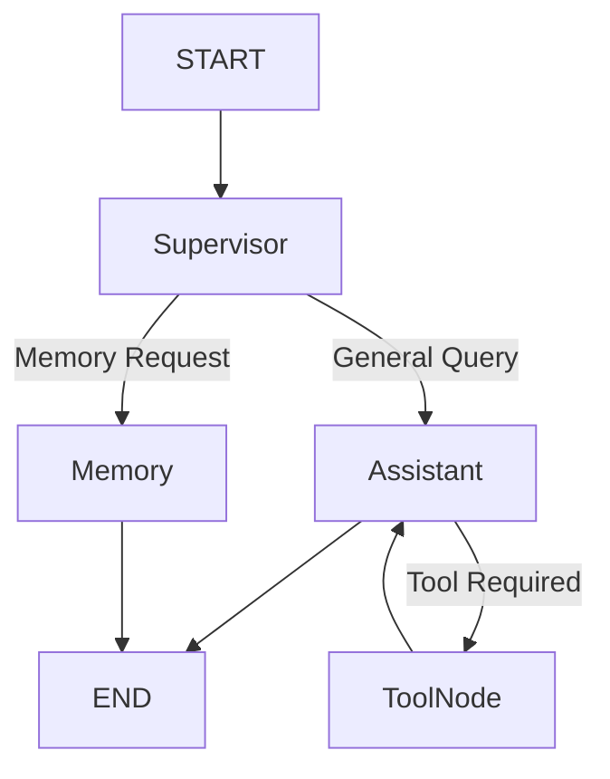

#  AI Assistant using LangGraph

A capstone project demonstrating how to build an **agentic AI assistant** using **LangGraph**, **LangChain**, and **Ollama**.

This project combines multiple LangGraph concepts—including state management, conditional routing, memory, ReAct-based reasoning, tool calling, and supervisor-based orchestration—into a single modular AI assistant.

Rather than acting as a simple chatbot, this example demonstrates how complex AI workflows can be represented as graphs, where each node has a well-defined responsibility and the execution flow changes dynamically based on the user's request.

---

#  Learning Objectives

After completing this example, you will understand how to:

- Build workflows using **StateGraph**
- Design modular AI agents using LangGraph
- Implement a Supervisor node for intelligent routing
- Store and retrieve user information using memory
- Integrate external tools using LangChain Tool Calling
- Build ReAct-style reasoning loops
- Manage state across multiple graph nodes
- Combine all previous workshop concepts into a complete AI assistant

---

#  Architecture



---

#  Project Structure

```text
10_ai_assistant/
│
├── app.py              # Command-line interface
├── agents.py           # LangGraph nodes
├── graph.py            # Graph construction
├── state.py            # Shared workflow state
├── memory.py           # Memory operations
├── tools.py            # External tools
├── prompts.py          # System prompts
├── config.py           # LLM configuration
└── README.md
```

---

#  Internal Working

This AI Assistant is implemented as a **LangGraph workflow**, where each node has a specific responsibility. Instead of sending every request directly to the language model, the request flows through multiple nodes that decide how it should be processed.

The workflow is shown below:

```text
                START
                  │
                  ▼
            Supervisor Node
          /                   \
         /                     \
 Memory Request?          General Query
       │                       │
       ▼                       ▼
 Memory Node            Assistant Node
                                │
                                ▼
                     Tool Required?
                         │     │
                    Yes  │     │ No
                         ▼     ▼
                     ToolNode  Response
                         │
                         ▼
                  Assistant Node
                         │
                         ▼
                        END
```

---

##  Step 1 — Supervisor Node

The Supervisor is the entry point of the workflow.

Its responsibility is to inspect the user's request and determine which part of the graph should handle it.

Examples:

| User Query | Decision |
|------------|----------|
| `What's my name?` | Route to Memory Node |
| `My name is Alice` | Route to Memory Node |
| `What is (125+375)*2?` | Route to Assistant Node |
| `What is the weather in Chennai?` | Route to Assistant Node |

The Supervisor ensures that only memory-related requests are sent to the memory module, while all other requests continue through the assistant.

---

##  Step 2 — Assistant Node

The Assistant Node is responsible for reasoning over the user's request.

It receives the conversation history along with the system prompt and decides whether:

- it can answer directly using the LLM, or
- it needs an external tool.

For example:

**Input**

```
Hi
```

Decision:

```
No tool required
```

---

**Input**

```
What is (125+375)*2?
```

Decision:

```
Calculator tool required
```

---

##  Step 3 — ToolNode

If the Assistant determines that a tool is required, the request is forwarded to the ToolNode.

The ToolNode executes the requested tool (such as the calculator or weather tool) and returns the result to the Assistant.

The Assistant then uses the tool output to generate a natural language response.

---

##  Step 4 — Memory Node

The Memory Node is responsible for storing and retrieving user-specific information.

Example:

User:

```
My name is Shambhavi
```

The Memory Node stores:

```
Name → Shambhavi
```

Later:

```
What's my name?
```

The Memory Node retrieves the stored value and returns it as the response.

---

##  Execution Flow

Depending on the user's request, the graph follows different execution paths.

### Greeting

```
START
 ↓
Supervisor
 ↓
Assistant
 ↓
END
```

---

### Mathematical Query

```
START
 ↓
Supervisor
 ↓
Assistant
 ↓
ToolNode
 ↓
Assistant
 ↓
END
```

---

### Memory Retrieval

```
START
 ↓
Supervisor
 ↓
Memory
 ↓
END
```

---

#  Running the Project

## Prerequisites

- Python 3.12+
- Ollama installed and running
- A supported LLM (e.g. Llama 3)

Install the dependencies:

```bash
pip install -r requirements.txt
```

Start Ollama:

```bash
ollama serve
```

Run the assistant:

```bash
cd examples/10_ai_assistant
python app.py
```

---

#  Example Queries

### General Conversation

```
Hi
```

Expected Flow

```
START
 ↓
Supervisor
 ↓
Assistant
 ↓
END
```

---

### Mathematical Calculation

```
What is (125+375)*2?
```

Expected Flow

```
START
 ↓
Supervisor
 ↓
Assistant
 ↓
ToolNode
 ↓
Assistant
 ↓
END
```

---

### Store Information

```
My name is Shambhavi.
```

Expected Flow

```
START
 ↓
Supervisor
 ↓
Memory
 ↓
END
```

---

### Retrieve Information

```
What's my name?
```

Expected Flow

```
START
 ↓
Supervisor
 ↓
Memory
 ↓
END
```

---

### Weather Query

```
What is the weather in Chennai?
```

Expected Flow

```
START
 ↓
Supervisor
 ↓
Assistant
 ↓
ToolNode
 ↓
Assistant
 ↓
END
```

---

#  LangGraph Concepts Demonstrated

This capstone project combines multiple concepts introduced throughout the workshop:

- **StateGraph** for workflow orchestration
- **MessagesState** for maintaining conversation state
- **Conditional Routing** through the Supervisor node
- **Memory Management** for storing and retrieving user information
- **Tool Calling** using LangChain tools
- **ReAct-style reasoning** for deciding when tools are required
- **Modular Agent Design** by separating responsibilities across nodes

---

#  Key Takeaways

By completing this project, you have learned how to:

- Build modular AI workflows using LangGraph.
- Separate responsibilities across graph nodes.
- Route requests intelligently using a Supervisor.
- Integrate external tools into an AI workflow.
- Persist and retrieve user-specific information.
- Implement ReAct-based reasoning.
- Combine multiple LangGraph concepts into a production-style agent.

---

#  Future Improvements

Some possible extensions to this project include:

- Persistent memory using a database.
- Support for multiple user profiles.
- Additional tools such as search and document retrieval.
- LangSmith tracing for workflow visualization.
- Multi-agent collaboration with specialized agents.
- Web interface using Streamlit or FastAPI.

---

##  References

- LangGraph Documentation
- LangChain Documentation
- Ollama Documentation