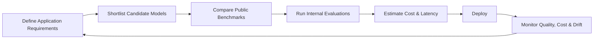

# LLM Evaluation & Cost Monitoring

---

## Table of Contents

1. The LLM Explosion
2. The Correct Question
3. What is an LLM Evaluation?
4. Why One Benchmark is Never Enough
5. MMLU
6. HumanEval
7. SWE-bench
8. GPQA
9. MMMU
10. LiveBench
11. Chatbot Arena
12. Different Jobs, Different Models
13. Model Selection at a Glance
14. Cost Monitoring
15. Tokens – The Currency of LLMs
16. Input vs Output Tokens
17. API Pricing
18. Latency & Throughput
19. Cost Optimization
20. Industry Workflow
21. Summary

---

# 1. The LLM Explosion

## Why are we suddenly hearing about so many LLMs?

A few years ago, there were only a handful of publicly available Large Language Models (LLMs). Today, the landscape has changed dramatically. Companies and research organizations around the world are continuously releasing newer, faster, cheaper, and more capable models.

Some of the most well-known models include:

| Company | Model Family |
|-----------|--------------|
| OpenAI | GPT |
| Anthropic | Claude |
| Google | Gemini |
| Meta | Llama |
| Alibaba | Qwen |
| DeepSeek | DeepSeek |
| Mistral AI | Mistral |
| Google | Gemma |

Every model has different strengths.

Some models excel at:

- Programming
- Mathematics
- Reasoning
- Document Analysis
- Scientific Research
- Customer Support
- Vision Tasks

while others may prioritize:

- Lower cost
- Faster responses
- Smaller hardware requirements
- Longer context windows

Because there are now hundreds of models available, choosing one has become an engineering problem rather than simply selecting the newest model.

---

## Why is choosing an LLM difficult?

Suppose you are building different AI applications.

### Application 1

A customer support chatbot.

Requirements:

- Cheap
- Fast
- Thousands of users simultaneously

Do you really need the smartest model available?

Probably not.

---

### Application 2

Medical diagnosis assistant.

Requirements:

- Extremely accurate
- Strong reasoning
- Scientific knowledge

Now accuracy matters much more than price.

---

### Application 3

GitHub Copilot-like coding assistant.

Requirements:

- Code generation
- Bug fixing
- Repository understanding

General knowledge is less important than software engineering ability.

---

This immediately shows an important lesson.

> Different applications require different models.

There is no universally perfect LLM.

---

## Key Takeaway

The rapid growth of LLMs has given engineers many choices.

Instead of asking

> "Which model is the best?"

we now ask

> "Which model is the best for my application?"

This change in mindset is one of the most important concepts in modern AI engineering.

---

# 2. The Correct Question

Many beginners compare LLMs like this:

- GPT-5 scored 90%
- Claude scored 88%
- Gemini scored 89%

Therefore,

GPT must be the best.

Unfortunately, this conclusion is usually wrong.

---

## Why?

Imagine asking:

> Who is the best athlete?

The answer depends on the sport.

The best swimmer may not be the best runner.

The best chess player may not be the best football player.

The exact same idea applies to LLMs.

---

Instead of searching for one universal winner, engineers first identify the problem they are trying to solve.

Questions they ask include:

- Is coding important?
- Does it need image understanding?
- How much latency is acceptable?
- What is the available budget?
- How many users will use the application?
- Is accuracy more important than speed?

Only after answering these questions do they compare models.

---

## Factors Used When Choosing an LLM

Modern AI engineers evaluate multiple factors simultaneously.

| Factor | Why It Matters |
|---------|----------------|
| Accuracy | Produces better answers |
| Cost | Determines deployment expense |
| Latency | User experience |
| Context Window | Larger documents can be processed |
| Benchmark Scores | Measures capability |
| Safety | Reduces harmful outputs |
| Throughput | Supports many users simultaneously |

No single factor determines the best model.

Instead, engineers balance all of these together.

---

## Key Takeaway

The correct question is not

> **Which LLM is the best?**

Instead ask

> **Which LLM is best suited for my application's requirements?**

This mindset will guide every topic covered throughout the rest of this workshop.

---

# 3. What is an LLM Evaluation?

Imagine a school examination.

Every student:

- receives the same paper
- gets the same amount of time
- follows the same rules

Only then can we compare scores fairly.

LLM evaluation works exactly the same way.

---

## Definition

An **LLM Evaluation Benchmark** is a standardized test used to measure what an LLM can and cannot do.

Every model:

- receives the same questions
- uses the same evaluation procedure
- is scored using the same metric

Because every model takes the same test, researchers can compare models fairly.

---

## Why are benchmarks needed?

Without benchmarks, comparing models would be impossible.

Suppose Company A says:

"Our model is amazing."

Company B says:

"Our model is even better."

How do we verify these claims?

By giving both models the exact same benchmark.

Their scores then provide an objective comparison.

---

## Components of a Benchmark

Every benchmark contains two essential parts.

### 1. A Fixed Set of Tasks

Examples include:

- Multiple-choice questions
- Programming problems
- Scientific reasoning
- Image understanding
- Real GitHub issues

The task never changes during an evaluation.

---

### 2. A Scoring Method

After solving the tasks, the model receives a score.

Common scoring metrics include:

| Metric | Meaning |
|----------|---------|
| Accuracy | Percentage of correct answers |
| Pass@1 | Percentage of programming problems solved correctly on the first attempt |
| Elo Rating | Ranking based on human preferences |

Different benchmarks use different scoring methods depending on what they are testing.

---

## Why aren't user opinions enough?

Imagine asking only one person whether an AI is good.

Their opinion could be biased.

Benchmarks reduce this subjectivity by evaluating every model under identical conditions.

This allows researchers, companies, and developers to compare models scientifically.

---

## Real-World Example

Suppose two models solve a benchmark with the following scores:

| Model | Accuracy |
|---------|----------|
| Model A | 82% |
| Model B | 91% |

Because both answered the exact same questions under the same conditions, we can confidently conclude that **Model B performed better on that benchmark**.

Notice the wording.

It performed better **on that benchmark**.

It does **not** necessarily mean it is better for every application.

---

## Important Note

A benchmark measures capability under controlled conditions.

Real-world applications often involve:

- noisy user inputs
- long conversations
- ambiguous instructions
- business-specific requirements

For this reason, public benchmark scores should always be combined with internal testing before deploying an LLM in production.

---

## Summary

An evaluation benchmark is a standardized exam for LLMs.

It consists of:

- A fixed set of tasks
- A consistent scoring method

Benchmarks help researchers compare models fairly and understand their strengths and weaknesses.

However, benchmarks measure only specific abilities and should not be treated as the sole indicator of model quality.

---

# 4. Why One Benchmark is Never Enough

A common mistake beginners make is comparing LLMs using only a single benchmark score.

For example, suppose someone says:

> "Model A scored 92% on MMLU, while Model B scored 88%. Therefore Model A is better."

This conclusion is incorrect.

Why?

Because **different benchmarks measure different abilities**.

---

## Think of Hiring a Software Engineer

Imagine you are interviewing candidates for a software engineering position.

Would you hire someone based on only one coding question?

Of course not.

Instead, you would evaluate them in multiple areas:

- Programming
- Debugging
- System Design
- Communication
- Problem Solving
- Teamwork

A candidate who writes excellent code may struggle with system design.

Another candidate may communicate exceptionally well but write average code.

Only after looking at **their complete profile** can you make a good hiring decision.

LLMs work exactly the same way.

---

## Every Benchmark Measures Something Different

Different benchmarks focus on different capabilities.

| Capability | Example Benchmark |
|------------|------------------|
| General Knowledge | MMLU |
| Coding | HumanEval |
| Software Engineering | SWE-bench |
| Scientific Reasoning | GPQA |
| Vision + Language | MMMU |
| Real-world Fresh Questions | LiveBench |
| Human Preference | Chatbot Arena |

No benchmark measures every capability simultaneously.

---

## Example

Imagine we have three models.

| Model | Coding | Vision | Knowledge |
|--------|--------|---------|------------|
| A | ⭐⭐⭐⭐⭐ | ⭐⭐ | ⭐⭐⭐ |
| B | ⭐⭐⭐ | ⭐⭐⭐⭐⭐ | ⭐⭐⭐⭐ |
| C | ⭐⭐ | ⭐⭐⭐ | ⭐⭐⭐⭐⭐ |

Which one is the best?

There is no correct answer.

If you are building GitHub Copilot, Model A is probably the best.

If you are building an image understanding system, Model B is better.

If you are building a tutoring chatbot, Model C may be the best choice.

The application determines which model is most suitable.

---

## Why Engineers Read a Score Profile

Professional AI engineers never rely on a single number.

Instead, they examine a model's **score profile**.

A score profile is simply a collection of benchmark scores across many different tasks.

For example:

| Benchmark | Model X |
|-----------|----------|
| MMLU | 90% |
| HumanEval | 95% |
| SWE-bench | 61% |
| GPQA | 82% |
| MMMU | 74% |

This gives a much clearer picture of what the model is good at.

---

## Key Takeaway

A benchmark is like a school subject.

One student may excel in Mathematics.

Another may excel in English.

Similarly, one LLM may excel at coding while another excels at scientific reasoning.

Never judge an LLM using only one benchmark.

Always examine its complete benchmark profile.

---

# 5. MMLU — The General Knowledge Exam

## What is MMLU?

**MMLU** stands for **Massive Multitask Language Understanding**.

It is one of the most widely used benchmarks for evaluating the **general knowledge and reasoning ability** of Large Language Models.

Think of MMLU as a massive university entrance examination covering dozens of different academic subjects.

Instead of focusing on one skill, it measures how well a model performs across many disciplines.

---

## Why was MMLU created?

Before benchmarks like MMLU existed, researchers evaluated models using small datasets that focused on only one subject.

For example:

- Mathematics
- English
- Biology

These evaluations could not answer an important question:

> **How knowledgeable is this model overall?**

MMLU was designed to solve this problem by testing many subjects in a single benchmark.

---

## What does MMLU test?

MMLU evaluates whether an LLM can answer questions requiring:

- Knowledge recall
- Logical reasoning
- Academic understanding
- Common sense
- Multi-step thinking

The questions span many different academic disciplines.

Examples include:

- Mathematics
- Physics
- Chemistry
- Biology
- Computer Science
- Economics
- Psychology
- Law
- History
- Philosophy
- Business
- Medicine

In total, MMLU covers **57 different subjects**.

---

## How Does MMLU Work?

Every participating model receives the exact same collection of multiple-choice questions.

Each question has one correct answer.

For example:

### Sample Question

Which planet is known as the Red Planet?

A. Venus

B. Jupiter

C. Mars

D. Saturn

Correct Answer:

**Mars**

The model selects one option.

Its prediction is compared against the correct answer.

This process is repeated thousands of times.

---

## How is MMLU Scored?

The benchmark uses **Accuracy**.

Accuracy simply means:

> **Percentage of questions answered correctly.**

The formula is:

```text
Accuracy =
(Number of Correct Answers / Total Questions) × 100
```

Example:

Suppose the benchmark contains

10,000 questions.

A model answers

8,700 correctly.

Accuracy

```text
8700 / 10000 × 100 = 87%
```

So the model's MMLU score is **87%**.

Higher accuracy generally indicates stronger general knowledge.

---

## What Makes MMLU Useful?

MMLU allows researchers to compare models under identical conditions.

Since every model answers the same questions, differences in scores can be attributed to differences in capability rather than differences in testing.

This makes MMLU one of the most trusted benchmarks in LLM research.

Many research papers report MMLU scores when introducing new language models because it provides a standardized measure of broad academic knowledge.

---

## Real-World Interpretation

Suppose two models achieve the following scores:

| Model | MMLU Score |
|--------|------------|
| Model A | 76% |
| Model B | 88% |

What does this tell us?

It suggests that **Model B answered a larger percentage of the benchmark questions correctly**, indicating stronger performance on this particular benchmark.

However, it **does not** automatically mean Model B is better at coding, image understanding, or software engineering.

Those abilities are measured by other benchmarks.

---

## Advantages of MMLU

- Covers many academic disciplines.
- Easy to compare models fairly.
- Widely accepted in AI research.
- Good indicator of broad reasoning ability.
- Frequently used in research papers and model announcements.

---

## Limitations of MMLU

Despite its popularity, MMLU has important limitations.

It **does not evaluate**:

- Programming ability
- Software engineering
- Image understanding
- Document analysis
- Long conversations
- Tool usage
- Real-world business workflows

A model with an excellent MMLU score may still perform poorly as a coding assistant or multimodal system.

---

## When Should You Care About MMLU?

MMLU is especially useful when building applications that require broad knowledge and reasoning.

Examples include:

- Educational tutors
- General-purpose chatbots
- Question-answering systems
- Knowledge assistants
- Research assistants

For these applications, MMLU provides valuable insight into how well a model understands a wide range of topics.

---

## Key Takeaway

Think of MMLU as the **general knowledge exam** for LLMs.

It tells us how well a model understands a broad range of academic subjects, but it does **not** measure coding, software engineering, vision, or many real-world skills.

Therefore, MMLU should always be considered alongside other benchmarks rather than being used as the only measure of model quality.

---

# 6. HumanEval — The Coding Quiz

## What is HumanEval?

HumanEval is a benchmark designed to evaluate an LLM's **ability to generate correct Python code**.

Unlike MMLU, where a model answers multiple-choice questions, HumanEval asks the model to **write Python functions** that solve programming problems.

Instead of selecting an answer from a list of options, the model must generate code that behaves exactly as expected.

This benchmark is widely used to compare the coding capabilities of language models and is especially useful when evaluating AI coding assistants.

---

## How Does HumanEval Work?

Each HumanEval problem consists of two main components:

1. **A function description**
2. **The expected behavior**

The model reads the problem statement and generates a Python function as its solution.

For example:

### Problem

Write a function that returns the factorial of a positive integer.

```python
def factorial(n):
    ...
```

The model generates an implementation for this function.

However, unlike traditional programming exams, the generated code is **not checked manually**.

Instead, it is automatically evaluated using **hidden unit tests**.

---

## Hidden Unit Tests

After the model generates its solution, the benchmark runs a collection of hidden test cases against the code.

For example:

```python
factorial(3) → 6
factorial(5) → 120
factorial(0) → 1
```

If the generated function passes all the hidden tests, the solution is considered correct.

These tests are called *hidden* because the model does not know them while generating its answer.

This prevents the model from simply memorizing expected outputs.

---

## How is HumanEval Scored?

The presentation introduces the metric **Pass@1**.

### What is Pass@1?

Pass@1 measures the percentage of programming problems that are solved correctly **on the very first generated solution**.

In other words:

- The model gets **one attempt**.
- That single solution is tested.
- If it passes all the hidden unit tests, it is counted as correct.

For example:

Suppose there are **100 programming problems**.

The model successfully solves **82** of them on its first attempt.

Then,

```text
Pass@1 = 82 / 100 × 100 = 82%
```

A higher Pass@1 score indicates that the model is more reliable at generating correct code immediately.

---

## Why is HumanEval Important?

HumanEval provides a standardized way to compare the coding ability of language models.

Since every model receives the same programming tasks and is evaluated using the same hidden tests, researchers can compare coding performance fairly.

This benchmark is particularly useful when evaluating models for applications such as:

- AI coding assistants
- Code generation tools
- Programming tutors
- Developer productivity tools

---

## Limitations

As highlighted in the presentation, HumanEval focuses on **small, self-contained programming tasks**.

It does **not** measure:

- Working with large codebases
- Understanding project structure
- Debugging existing software
- Reading multiple files
- Fixing real software bugs
- Software engineering workflows

Therefore, a model with a high HumanEval score is not automatically the best model for professional software development.

---

## Key Takeaway

Think of HumanEval as a **coding quiz**.

It measures whether a model can generate correct Python code for individual programming problems.

However, writing a small function is very different from maintaining a large software project.

To evaluate those skills, we need another benchmark.

---

# 7. SWE-bench — The Real Software Engineering Test

## What is SWE-bench?

SWE-bench evaluates an LLM's ability to solve **real software engineering problems**.

Instead of solving isolated coding questions, the model works with:

- Real GitHub repositories
- Actual issue reports
- Existing source code
- Automated test suites

This makes SWE-bench much closer to the work performed by professional software engineers.

---

## How Does SWE-bench Work?

Each task begins with a **real GitHub issue**.

The model receives:

- the issue description
- the project's source code
- the repository structure

Its goal is to understand the reported problem and modify the code so that the issue is resolved.

Rather than writing a brand-new program, the model must work within an existing software project.

---

## What is a Patch?

A **patch** is a set of code changes made to fix a problem.

In SWE-bench, the model generates a patch that modifies the repository.

This patch should resolve the reported issue while preserving the existing functionality of the project.

---

## How is SWE-bench Scored?

A solution is considered successful **only if both conditions are satisfied**:

1. The generated patch fixes the GitHub issue.
2. All automated repository tests pass successfully.

If either condition fails, the solution is considered incorrect.

This makes SWE-bench a much stricter benchmark than traditional coding tests.

---

## Why is SWE-bench Important?

Real software engineering involves much more than writing code.

Developers spend a significant amount of time:

- reading existing code
- understanding project structure
- locating bugs
- modifying existing functions
- ensuring that changes do not introduce new errors

SWE-bench evaluates these practical skills.

For this reason, it has become one of the most important benchmarks for measuring the software engineering capabilities of modern LLMs.

---

## HumanEval vs SWE-bench

Although both benchmarks evaluate coding ability, they measure different skills.

| HumanEval | SWE-bench |
|-----------|-----------|
| Small Python programming tasks | Real GitHub repositories |
| Generate a new function | Modify existing code |
| Hidden unit tests | Full repository test suite |
| Individual coding ability | Software engineering ability |

HumanEval asks:

> **"Can the model write code?"**

SWE-bench asks:

> **"Can the model work like a software engineer?"**

---

## Limitations

As mentioned in the presentation, SWE-bench has several limitations.

It is:

- Computationally expensive.
- Repository-specific.
- Focused on software engineering rather than general coding ability.

Because of this, SWE-bench should be interpreted together with benchmarks such as HumanEval.

Together, they provide a more complete picture of a model's coding capabilities.

---

## Key Takeaway

HumanEval measures **programming ability**.

SWE-bench measures **software engineering ability**.

A strong coding assistant should perform well on **both** benchmarks, because writing code and maintaining real software projects require different skills.

---

# 8. GPQA — The PhD-Level Challenge

## What is GPQA?

GPQA stands for **Graduate-Level Google-Proof Question Answering**.

As introduced in the presentation, GPQA is a benchmark designed to evaluate whether an LLM can answer **highly specialized graduate-level science questions** that require expert knowledge and reasoning.

Unlike general knowledge benchmarks such as MMLU, GPQA focuses only on advanced scientific domains.

Its goal is to determine whether an LLM can reason through difficult scientific problems that are challenging even for domain experts.

---

## What Subjects Does GPQA Cover?

The benchmark contains carefully designed multiple-choice questions from graduate-level science disciplines such as:

- Biology
- Chemistry
- Physics

These questions are intentionally difficult.

Many questions require the model to:

- Recall advanced scientific knowledge.
- Connect multiple scientific concepts.
- Apply logical reasoning instead of simple memorization.

This makes GPQA significantly more challenging than general knowledge benchmarks.

---

## How Does GPQA Work?

Every model receives the same collection of multiple-choice scientific questions.

For each question, the model selects one answer from the available options.

The selected answer is then compared with the correct answer.

This process is repeated for every question in the benchmark.

Because every model answers the same questions under the same conditions, GPQA provides a fair comparison of scientific reasoning ability.

---

## How is GPQA Scored?

The presentation states that GPQA uses **Accuracy**.

Accuracy represents the percentage of questions answered correctly.

The calculation is:

```text
Accuracy =
(Correct Answers / Total Questions) × 100
```

For example,

Suppose there are **500 questions**.

If a model answers **430 correctly**, then

```text
Accuracy = 430 / 500 × 100 = 86%
```

A higher accuracy indicates stronger scientific reasoning and domain knowledge.

---

## Why is GPQA Important?

Many real-world AI applications require more than general knowledge.

Examples include:

- Scientific research assistants
- Drug discovery
- Medical research
- Academic assistants

For these applications, understanding advanced scientific concepts is extremely important.

GPQA helps researchers compare how well different language models perform on these demanding scientific tasks.

---

## Limitations

As highlighted in the presentation, GPQA focuses **only on expert-level science**.

It does **not** evaluate:

- Coding ability
- Software engineering
- Image understanding
- General real-world performance

Therefore, GPQA should be viewed as a benchmark for **scientific reasoning**, not overall model capability.

---

## Key Takeaway

Think of GPQA as a **graduate-level science examination**.

A high GPQA score suggests that a model performs well on difficult scientific reasoning tasks, but it does not necessarily indicate strong performance in coding, multimodal understanding, or general-purpose applications.

---

# 9. MMMU — Testing Vision & Language Together

## What is MMMU?

MMMU stands for **Massive Multi-discipline Multimodal Understanding**.

Unlike the previous benchmarks, MMMU evaluates an LLM's ability to understand **both text and visual information simultaneously**.

Rather than answering questions based only on text, the model must interpret visual content before producing an answer.

This makes MMMU an important benchmark for multimodal language models.

---

## What Types of Images Are Used?

According to the presentation, models answer questions based on images such as:

- Charts
- Diagrams
- Graphs
- Scientific figures
- Maps
- Tables

These images come from multiple academic disciplines, requiring both visual understanding and reasoning.

---

## Why Isn't Image Recognition Enough?

Recognizing objects inside an image is only the first step.

The model must also understand **what the image means**.

For example,

Imagine a graph showing population growth.

The model should not simply recognize that it is a graph.

It should also answer questions such as:

- Which year has the highest population?
- What trend does the graph show?
- Which country experienced the fastest growth?

This combination of visual understanding and reasoning is what MMMU measures.

---

## How Does MMMU Work?

The model receives:

- an image
- a question related to that image

It must combine information from both sources to produce the correct answer.

Because every model receives the same questions and images, researchers can compare multimodal capabilities fairly.

---

## How is MMMU Scored?

The presentation states that MMMU uses **Accuracy**.

Accuracy measures the percentage of multimodal questions answered correctly.

Higher accuracy indicates better multimodal reasoning ability.

---

## Why is MMMU Important?

Modern AI applications increasingly work with both text and images.

Examples include:

- Medical imaging
- Education
- Document analysis

These applications require a model to understand visual information and reason about it.

MMMU helps evaluate these capabilities in a standardized manner.

---

## Limitations

As mentioned in the presentation, MMMU focuses on multimodal reasoning.

It does **not** evaluate:

- Coding ability
- Software engineering performance

For these skills, other benchmarks such as HumanEval and SWE-bench are more appropriate.

---

## Key Takeaway

MMMU measures whether an LLM can combine **vision and language** to answer questions accurately.

It is particularly useful when evaluating multimodal models designed for image-based tasks.

---

# 10. LiveBench — The Continuously Updated Benchmark

## What is LiveBench?

Most benchmarks remain unchanged after they are released.

As models improve, there is a possibility that they may eventually become familiar with these fixed evaluation datasets.

To address this challenge, the presentation introduces **LiveBench**.

LiveBench is a **dynamic benchmark** that continuously introduces fresh evaluation questions reflecting current real-world challenges.

Instead of remaining static, new tasks are regularly added.

---

## Why Was LiveBench Created?

Static benchmarks are excellent for fair comparisons.

However, if the same questions are used for years, they may become less effective at measuring current capabilities.

LiveBench attempts to overcome this limitation by continually updating the evaluation set.

This helps provide a more realistic measure of current model performance.

---

## What Does LiveBench Evaluate?

According to the presentation, LiveBench evaluates models across multiple categories, including:

- Reasoning
- Coding
- Mathematics
- Instruction Following

Scores from these categories are aggregated into an overall ranking.

---

## How Does LiveBench Work?

Models periodically solve newly added evaluation tasks.

Instead of relying on a fixed question set, the benchmark evolves over time.

This allows researchers to compare how models perform on newer challenges rather than only historical datasets.

---

## Why is LiveBench Important?

The AI landscape changes rapidly.

New models appear frequently, and their capabilities continue to improve.

A continuously updated benchmark provides a better reflection of how well modern models perform on current tasks.

---

## Limitations

The presentation notes one important limitation.

Because the benchmark changes over time, scores from different evaluation periods may **not always be directly comparable**.

A model evaluated today may face a different set of questions than one evaluated several months later.

Therefore, historical comparisons should be interpreted carefully.

---

## Key Takeaway

LiveBench provides a continuously evolving evaluation that better reflects modern LLM capabilities.

Its dynamic nature makes it valuable, but changing question sets mean scores across different time periods should not always be compared directly.

---

# 11. Chatbot Arena — Humans Decide the Winner

## What is Chatbot Arena?

Most benchmarks compare models using predefined questions.

Chatbot Arena takes a different approach.

Instead of using fixed benchmark datasets, it evaluates models based on **human preferences**.

The central question becomes:

> Which response do people actually prefer?

---

## How Does Chatbot Arena Work?

Two anonymous language models receive exactly the same user prompt.

Each model independently generates a response.

A human evaluator reads both responses without knowing which model produced them.

The evaluator simply votes for the response they prefer.

Because the identities of the models are hidden, the comparison focuses entirely on response quality rather than brand recognition.

---

## How are Models Ranked?

The presentation explains that Chatbot Arena uses an **Elo Rating System**.

Every vote slightly adjusts the ratings of both participating models.

Models that consistently produce responses preferred by users gradually receive higher Elo ratings.

Over many comparisons, this creates an overall ranking of language models.

---

## What Does Chatbot Arena Measure?

Unlike traditional academic benchmarks, Chatbot Arena evaluates qualities that are difficult to measure automatically, including:

- Helpfulness
- Clarity
- Creativity
- User satisfaction

These qualities are especially important for conversational AI systems.

---

## Why is Chatbot Arena Important?

A model may perform extremely well on academic benchmarks while still producing responses that users find confusing or unhelpful.

Chatbot Arena helps measure the human side of language model performance.

For chatbot applications, this type of evaluation is often just as valuable as traditional benchmark scores.

---

## Limitations

As noted in the presentation, Chatbot Arena has one important limitation.

Human preferences are subjective.

Different users may prefer different writing styles, levels of detail, or response formats.

As a result, rankings may vary depending on:

- The prompts being used.
- The preferences of the evaluators.

---

## Key Takeaway

Chatbot Arena answers a different question than traditional benchmarks.

Instead of asking,

> "Which model solved more questions correctly?"

it asks,

> "Which response did humans actually prefer?"

Together with traditional benchmarks, it provides a more complete picture of a language model's real-world usefulness.

---


# 12. Different Jobs, Different Models

By now, we've seen that every benchmark measures a different capability.

The next question naturally becomes:

> **How do AI engineers use these benchmark scores to choose a model?**

The answer depends entirely on the application.

Different applications require different capabilities, so they prioritize different benchmarks.

This is why there is **no single LLM that is best for every task**.

---

## Coding Assistant

Examples:

- GitHub Copilot
- Cursor
- Continue.dev
- Windsurf

### Requirements

According to the presentation, a coding assistant should prioritize:

- High coding accuracy
- Strong debugging ability
- Repository understanding

Let's understand why each requirement matters.

### High Coding Accuracy

The model should generate code that is syntactically correct and logically correct.

Incorrect code wastes developer time and reduces trust in the assistant.

---

### Strong Debugging Ability

Developers spend a large portion of their time fixing existing code rather than writing new code.

A useful coding assistant should therefore understand bugs and suggest appropriate fixes.

---

### Repository Understanding

Real software projects contain:

- Multiple files
- Existing classes
- Libraries
- Dependencies
- Project structure

The model should understand this larger context instead of treating every function independently.

---

### Important Benchmarks

According to the presentation, the two most important benchmarks are:

- **HumanEval**
- **SWE-bench**

These complement each other.

HumanEval measures whether the model can generate correct code.

SWE-bench measures whether it can work on real software projects.

Together, they provide a strong indication of coding capability.

---

## Customer Support Chatbot

Examples include:

- Banking assistants
- E-commerce support
- Airline support
- Help desk chatbots

Unlike coding assistants, customer support systems have different priorities.

### Requirements

According to the presentation:

- Low latency
- Low cost
- Reliable instruction following
- High throughput

Let's understand why.

---

### Low Latency

Users expect immediate responses.

Even a few seconds of delay can negatively affect user experience.

Fast responses make conversations feel more natural.

---

### Low Cost

Customer support systems may handle thousands or even millions of conversations every day.

Even a small increase in cost per request can significantly increase monthly expenses.

Therefore, inexpensive models are often preferred.

---

### Reliable Instruction Following

The chatbot should answer exactly according to company policies.

For example,

If instructed to never reveal internal information, the model should consistently follow that instruction.

---

### High Throughput

Throughput refers to how many requests the system can handle efficiently.

Large organizations often receive many user queries simultaneously.

The model should support this workload without becoming a bottleneck.

---

### Important Benchmarks

The presentation identifies:

- Chatbot Arena
- LiveBench

Chatbot Arena measures how helpful users find the responses.

LiveBench evaluates capabilities on fresh and realistic tasks.

Together, these provide useful information when selecting models for conversational AI.

---

## Research & Scientific Assistant

Examples include:

- Academic assistants
- Scientific literature assistants
- Research support tools

### Requirements

The presentation highlights two key requirements:

- Deep reasoning
- Scientific knowledge

Scientific applications often involve complex concepts and require accurate reasoning.

---

### Important Benchmarks

According to the presentation:

- GPQA
- MMLU

GPQA evaluates graduate-level scientific reasoning.

MMLU evaluates broad academic knowledge.

These benchmarks together provide insight into a model's ability to assist with research-oriented tasks.

---

## Vision & Document AI

Examples include:

- OCR systems
- Invoice processing
- Medical image assistants
- Document understanding

### Requirements

The presentation lists:

- Image understanding
- Chart & table interpretation
- OCR + reasoning

These applications require models to combine visual information with language understanding.

---

### Important Benchmarks

The presentation identifies:

- MMMU
- LiveBench

MMMU measures multimodal understanding.

LiveBench includes continuously updated evaluations that also assess broader capabilities.

---

## Key Lesson

The presentation emphasizes one of the most important ideas of this workshop:

> **No single LLM excels at every task.**

Different applications prioritize different capabilities.

Therefore, AI engineers select models based on:

- Benchmark performance
- Latency
- Cost
- Context window
- Deployment requirements

rather than simply choosing the model with the highest overall score.

---

# 13. Model Selection at a Glance

The previous section discussed model selection conceptually.

This section summarizes that decision-making process using practical examples.

---

## Customer Support

### Top Priority

Speed and cost.

A support chatbot must answer quickly while serving a large number of users.

### Key Benchmark

According to the presentation:

**Chatbot Arena**

because human satisfaction is critical.

### Recommended Model Type

Small or fast models.

### Cost Sensitivity

**Very High**

Since these systems process thousands of requests every day, reducing cost has a major business impact.

---

## Coding Assistant

### Top Priority

Code accuracy.

Generating correct code is more important than producing responses quickly.

### Key Benchmarks

- SWE-bench
- HumanEval

These evaluate both programming ability and software engineering skills.

### Recommended Model Type

Large reasoning models.

These models generally perform better on complex programming tasks.

### Cost Sensitivity

**Medium**

Organizations are often willing to pay more if the coding assistant significantly improves developer productivity.

---

## Medical AI

### Top Priority

Correctness.

Medical applications demand reliable reasoning and accurate responses.

### Key Benchmarks

- GPQA
- MMMU

These evaluate scientific reasoning and multimodal understanding.

### Recommended Model Type

Frontier models.

These models generally provide stronger reasoning capabilities.

### Cost Sensitivity

**Low**

Accuracy is significantly more important than minimizing API cost.

---

## Vision AI

### Top Priority

Multimodal understanding.

The model should interpret both images and accompanying text.

### Key Benchmark

MMMU

This benchmark specifically evaluates vision-language reasoning.

### Recommended Model Type

Multimodal models.

### Cost Sensitivity

**Medium**

The appropriate balance depends on the application's scale and requirements.

---

## What Does This Table Teach Us?

Notice that the recommended model changes depending on the application.

The model selected for customer support is different from the one selected for coding or medical reasoning.

This reinforces the central message of the workshop:

> The best model depends on the application's requirements, not on a single benchmark score.

---

# 14. Cost Monitoring

Choosing the right model is only the first step.

Once an LLM is deployed, engineers must continuously monitor its operational cost.

The presentation identifies three important areas:

1. API Pricing
2. Cost Optimization
3. Cost Monitoring

Together, these help organizations build AI systems that remain efficient, scalable, and within budget.

---

## API Pricing

Most commercial LLM providers charge based on **tokens**.

Every API request includes:

- Input tokens
- Output tokens

Longer prompts require more input tokens.

Longer responses require more output tokens.

As a result, larger prompts and longer answers increase the overall cost.

Different language models also have different pricing structures.

Choosing a more powerful model often comes with a higher cost.

---

## Cost Optimization

Reducing cost is an important part of deploying AI systems at scale.

The presentation highlights several common optimization strategies.

These include:

- Using smaller models for simple tasks.
- Reducing prompt length.
- Reducing output length.
- Using prompt caching.
- Using batch inference.
- Routing only complex queries to more powerful models.

These techniques allow organizations to lower operating costs without significantly affecting application quality.

The optimization techniques will be discussed in more detail later in this guide.

---

## Cost Monitoring

Optimization alone is not sufficient.

Engineers must also continuously monitor how the system behaves after deployment.

According to the presentation, important metrics include:

- Token usage
- API requests
- Latency
- Daily spending

Monitoring these metrics helps identify unexpected increases in cost or performance issues.

Organizations often set spending limits and alerts so that unusual usage can be detected quickly.

Continuous monitoring also helps engineers improve the system over time by identifying opportunities for further optimization.

---

## Key Takeaway

Running LLM applications at scale requires balancing three important factors:

- Performance
- Cost
- Scalability

Effective monitoring ensures that applications remain useful for users while staying within budget.

The following sections explain the concepts of tokens, pricing, latency, and optimization in greater detail.

---

# 15. Tokens — The Currency of LLMs

## Overview

Large Language Models do not process text as words or sentences. Instead, they process **tokens**, which are smaller units of text. Every commercial LLM API measures usage and calculates pricing based on the number of tokens processed.

Understanding tokens is essential because they directly determine the cost of running an LLM application.

---

## What is a Token?

A **token** is a unit of text that may represent:

- A complete word
- Part of a word
- A punctuation symbol

The exact tokenization depends on the tokenizer used by the model.

For example,

```
Evaluation is important
```

may be tokenized as

```
Eval | uation | is | important
```

Although the sentence contains only three words, it contains **four tokens**.

> **Important:** One word is **not** always equal to one token.

---

## Approximate Token Size

A useful approximation is:

> **1 token ≈ ¾ of an English word (approximately 4 characters).**

This estimate is helpful for rough cost calculations, although the actual number of tokens depends on the tokenizer.

---

## Why Tokens Matter

Every API request consists of tokens.

The provider counts:

- Tokens sent to the model
- Tokens generated by the model

Billing is based entirely on these token counts.

Therefore,

- longer prompts,
- longer documents,
- larger chat histories,
- and longer responses

all increase the total cost.

---

## Key Points

- LLMs process **tokens**, not words.
- Tokens are the billing unit of every LLM API.
- Longer text results in more tokens.
- More tokens result in higher API costs.

---

# 16. Input Tokens, Output Tokens & the Context Window

## Input Tokens

Input tokens include **everything sent to the model**.

This includes:

- User prompts
- System prompts
- Uploaded documents
- Conversation history
- Tool outputs

Every token contained in the request contributes to the total input token count.

---

## Output Tokens

Output tokens are **all tokens generated by the model**.

Examples include:

- Answers
- Explanations
- Code
- Summaries
- Tables

Longer responses generate more output tokens and therefore increase the overall API cost.

---

## Input vs Output Pricing

Many commercial LLM providers charge different prices for input and output tokens.

In many pricing models,

> **Output tokens cost approximately 3–5× more than input tokens.**

As a result, unnecessarily long responses can significantly increase deployment costs.

---

## Context Window

The **context window** is the maximum number of tokens that a model can process during a single request.

The context window includes **both**:

- Input tokens
- Output tokens

```
Context Window

┌─────────────────────────────────────────────┐
│ Input Tokens │ Output Tokens │
└─────────────────────────────────────────────┘

Total Tokens ≤ Context Window
```

Modern LLMs commonly support context windows ranging from **128K tokens** to **over 1 million tokens**, depending on the model.

A larger context window enables the model to process:

- Long research papers
- Large code repositories
- Multiple documents
- Long conversations

---

## Chat History and Cost

During a conversation, previous messages are usually included again with every new request so that the model retains context.

Consequently,

- longer conversations require more input tokens,
- increasing the cost of every subsequent request.

This is one of the primary reasons production systems summarize or trim older conversation history.

---

## Key Points

- Input tokens represent everything sent to the model.
- Output tokens represent everything generated by the model.
- Output tokens are generally more expensive.
- The context window limits how many tokens can be processed in one request.

---

# 17. API Pricing — Worked Example

## Scenario

Consider a customer support chatbot with the following workload.

### Pricing

| Token Type | Cost |
|------------|------:|
| Input Tokens | $3 / 1M tokens |
| Output Tokens | $15 / 1M tokens |

### Daily Usage

- 10,000 conversations/day
- 2,000 input tokens per conversation
- 500 output tokens per conversation

---

## Step 1 — Calculate Total Input Tokens

```
10,000 conversations × 2,000 tokens

= 20,000,000 input tokens

= 20 million tokens
```

---

## Step 2 — Calculate Input Cost

```
20 million tokens

×

$3 per million

=

$60/day
```

---

## Step 3 — Calculate Total Output Tokens

```
10,000 conversations × 500 tokens

=

5,000,000 output tokens

=

5 million tokens
```

---

## Step 4 — Calculate Output Cost

```
5 million tokens

×

$15 per million

=

$75/day
```

---

## Step 5 — Daily Cost

```
Input Cost

+

Output Cost

=

$60

+

$75

=

$135/day
```

---

## Step 6 — Monthly Cost

```
$135/day × 30

=

$4,050/month
```

---

## Comparing with a Smaller Model

Consider another model with the following pricing.

| Token Type | Cost |
|------------|------:|
| Input Tokens | $0.25 / 1M |
| Output Tokens | $1.25 / 1M |

For the same workload,

```
Monthly Cost ≈ $340
```

This is approximately **12× cheaper** than the frontier model.

The example demonstrates that model selection has a significant impact on deployment cost.

---

## Key Points

- API cost depends on token usage.
- More users increase total cost.
- Longer prompts increase input cost.
- Longer responses increase output cost.
- Choosing the appropriate model can reduce operating expenses substantially.

---

# 18. Latency & Throughput

## Latency

**Latency** is the time taken for a model to respond to a request.

Lower latency produces a better user experience, especially for interactive applications.

---

## Time To First Token (TTFT)

**Time To First Token (TTFT)** measures the time between sending a request and receiving the **first generated token**.

A lower TTFT makes the model appear much faster because users begin seeing the response almost immediately.

For conversational systems, TTFT is often more important than the total response time.

---

## Throughput

**Throughput** measures how quickly a model generates output after it begins responding.

It is commonly measured in:

> **Tokens per second**

Higher throughput produces faster streaming responses.

---

## Different Applications Have Different Priorities

### Real-Time Chat

Priority:

- Low latency
- Low TTFT

Users expect immediate responses.

---

### Batch Processing

Examples:

- Overnight report generation
- Large-scale document summarization
- Dataset processing

Priority:

- Lower cost

Latency is less important because users are not waiting for an immediate response.

---

## The Trade-off Triangle

Every deployment involves balancing three competing goals.

```text
          Smart
            ▲
           / \
          /   \
         /     \
        /       \
      Fast ----- Cheap
```

In most practical scenarios, improving one property requires sacrificing another.

For example,

- Faster models may cost more.
- Cheaper models may provide lower reasoning quality.
- Smarter models often have higher latency.

Selecting the appropriate balance depends on the application's requirements.

---

## Key Points

- Latency measures response time.
- TTFT measures how quickly the first token appears.
- Throughput measures generation speed.
- Different applications prioritize different performance metrics.

---

# 19. Cost Optimization Techniques

Reducing API costs is an essential part of deploying LLM applications at scale.

Several engineering techniques can significantly reduce operating expenses while maintaining acceptable model performance.

---

## Model Routing

Simple requests are processed by smaller, less expensive models.

Only difficult requests are forwarded to larger reasoning models.

This approach reduces overall cost without noticeably affecting quality.

---

## Prompt Caching

Many requests contain identical information, such as:

- System prompts
- Company policies
- Documentation

Prompt caching allows repeated prompt components to be reused instead of processed again, reducing both latency and cost.

---

## Batch API

Some tasks do not require immediate responses.

Examples include:

- Data analysis
- Report generation
- Offline processing

These requests can be grouped together and processed later using batch APIs, often at significantly reduced prices.

---

## Shorter Prompts & Outputs

Reducing unnecessary instructions and limiting response length directly decreases token usage.

Fewer tokens result in lower API costs.

---

## Trim Chat History

Long conversations continuously increase the number of input tokens.

Older conversation history can be summarized or removed while preserving the important context.

This reduces token usage without significantly affecting response quality.

---

## Distillation / Fine-Tuning

A smaller model can be trained to imitate a larger model for a specific application.

After training, the smaller model often provides comparable performance at a much lower operating cost.

---

## Key Points

- Route simple queries to smaller models.
- Reuse repeated prompts through caching.
- Use batch APIs for non-urgent workloads.
- Reduce unnecessary token usage.
- Summarize long conversations.
- Deploy specialized smaller models whenever appropriate.

---

# 20. The Industry Workflow

## Overview

Selecting and deploying a Large Language Model is not a one-time decision. It is an iterative engineering process that balances model capability, deployment cost, latency, and application requirements.

The workflow below represents a typical process followed when building production-ready LLM applications.



---

## Step 1 — Define the Application

The first step is to clearly identify the problem that the application is intended to solve.

Typical questions include:

- Is the application a chatbot?
- Does it generate code?
- Does it analyse images?
- Does it answer scientific questions?
- What level of accuracy is required?
- What latency is acceptable?
- What is the deployment budget?

These requirements determine which capabilities are most important.

---

## Step 2 — Shortlist Candidate Models

Once the requirements are known, a small set of suitable models can be selected.

The shortlist typically contains three to five models that satisfy the application's constraints.

At this stage, engineers consider factors such as:

- Cost
- Context window
- Deployment options
- Multimodal support
- API availability

The objective is not to find the best model immediately, but to identify reasonable candidates for further evaluation.

---

## Step 3 — Compare Public Benchmarks

Public benchmarks provide an initial estimate of a model's strengths and weaknesses.

Different benchmarks evaluate different capabilities.

| Requirement | Benchmark |
|-------------|-----------|
| General Knowledge | MMLU |
| Coding | HumanEval |
| Software Engineering | SWE-bench |
| Scientific Reasoning | GPQA |
| Vision & Language | MMMU |
| Human Preference | Chatbot Arena |
| Recent Capabilities | LiveBench |

These benchmark scores help eliminate models that are clearly unsuitable for the intended application.

However, benchmark performance alone should never determine the final choice.

---

## Step 4 — Run Internal Evaluations

Public benchmarks cannot capture the unique requirements of every application.

Therefore, candidate models should also be evaluated using internal datasets that closely represent real production workloads.

Examples include:

- Customer support conversations
- Company documentation
- Internal coding tasks
- Medical reports
- Business-specific queries

Internal evaluations provide a more accurate indication of real-world performance than public benchmarks alone.

---

## Step 5 — Estimate Cost and Latency

Before deployment, operational requirements should be estimated.

Important considerations include:

- Expected daily requests
- Average input tokens
- Average output tokens
- API pricing
- Response latency
- Throughput

These estimates help determine whether a model can be deployed within the available budget while maintaining acceptable performance.

---

## Step 6 — Deploy

After selecting the most appropriate model, it can be integrated into the application.

Deployment may involve:

- API-based inference
- Cloud deployment
- On-premise deployment
- Hybrid architectures

The selected deployment strategy depends on factors such as cost, scalability, privacy, and infrastructure requirements.

---

## Step 7 — Monitor

Deployment is not the end of the workflow.

Production systems require continuous monitoring.

Important metrics include:

- Response quality
- Token usage
- API cost
- Latency
- Throughput
- Failure rates

Monitoring helps identify issues early and provides opportunities for further optimization.

---

## Continuous Improvement

The LLM ecosystem evolves rapidly.

New models are released frequently, benchmark scores improve, pricing changes, and application requirements evolve.

As a result, model selection should be viewed as a continuous process rather than a one-time decision.

Periodic re-evaluation ensures that the deployed model continues to provide the best balance between quality, cost, and performance.

---

## Key Points

- Model selection is an engineering workflow.
- Public benchmarks provide an initial comparison.
- Internal evaluations validate real-world performance.
- Cost and latency must be estimated before deployment.
- Continuous monitoring enables long-term optimization.

---

# 21. Summary

## Key Takeaways

### 1. Benchmarks are Standardized Evaluations

Benchmarks allow different language models to be compared fairly by evaluating them using the same tasks under identical conditions.

Different benchmarks measure different capabilities, making multiple evaluations necessary.

---

### 2. No Model Excels at Every Task

Every model has unique strengths and weaknesses.

A model that performs exceptionally well on coding tasks may not perform equally well on scientific reasoning or multimodal understanding.

Model selection should therefore be driven by application requirements rather than a single benchmark score.

---

### 3. Public Benchmarks are Only the Starting Point

Public benchmarks help identify promising models.

However, the final decision should always be supported by internal evaluations using data that closely represents the target application.

Real-world performance is ultimately more important than benchmark rankings.

---

### 4. Tokens Determine Cost

Commercial LLM APIs charge based on token usage.

Both input tokens and output tokens contribute to the total deployment cost.

Efficient prompt design and response generation play an important role in controlling expenses.

---

### 5. Performance, Cost and Latency Must be Balanced

Choosing an LLM always involves trade-offs.

Increasing model capability often increases both latency and operational cost.

The optimal choice depends on the priorities of the application.

---

### 6. Cost Optimization is an Engineering Requirement

Techniques such as:

- Model routing
- Prompt caching
- Batch processing
- Prompt optimization
- Conversation summarization
- Fine-tuning

can significantly reduce deployment costs while maintaining acceptable quality.

---

### 7. Model Selection is a Continuous Process

The LLM landscape changes rapidly.

New models, pricing structures and benchmark results appear regularly.

Continuous monitoring and periodic re-evaluation help ensure that deployed systems remain efficient and effective over time.

---

# The One Thing to Remember

The most common question asked when comparing language models is:

> **Which LLM is the best?**

This is not the right question.

The correct question is:

> **Which LLM is the best for my application?**

Every application has different priorities.

Some require:

- High reasoning ability.
- Low latency.
- Low deployment cost.
- Strong coding performance.
- Multimodal understanding.
- Scientific expertise.

The role of an AI engineer is not to identify a universally superior model, but to select the model that best satisfies the requirements of the specific application.

Successful model selection is achieved by combining:

- Benchmark evaluations
- Internal testing
- Cost estimation
- Performance analysis
- Continuous monitoring

rather than relying on a single benchmark score or overall ranking.

---

