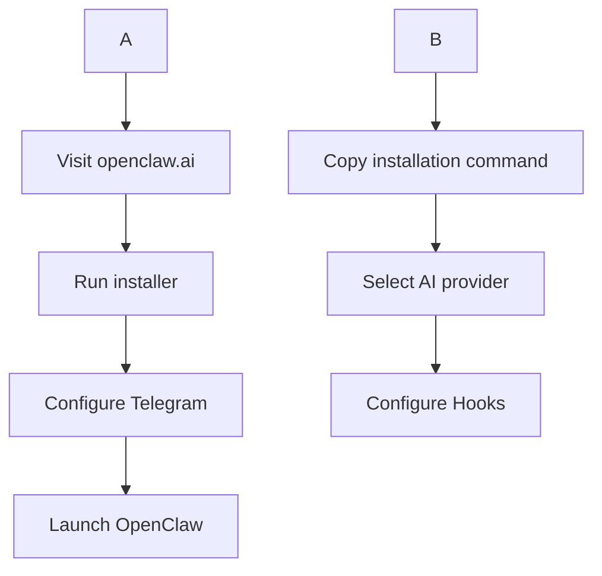
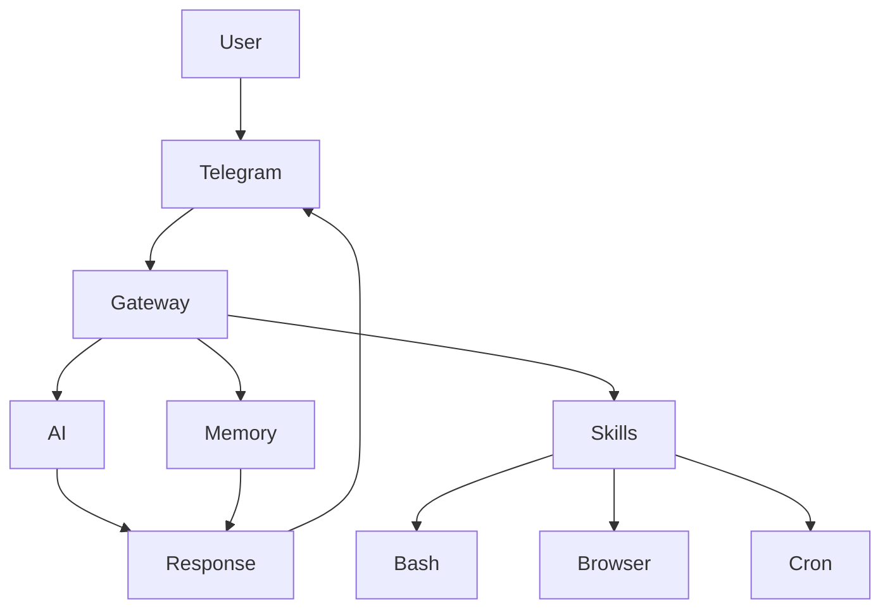
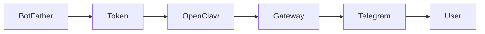
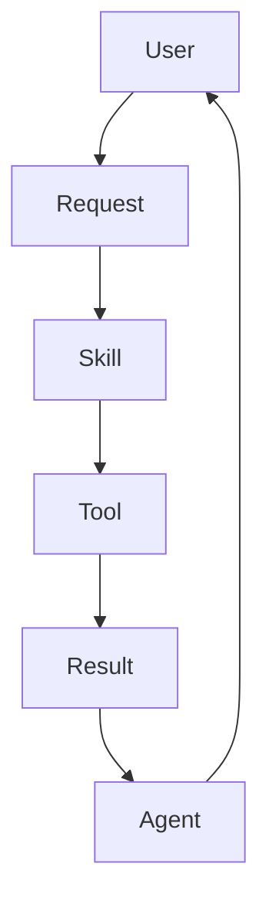
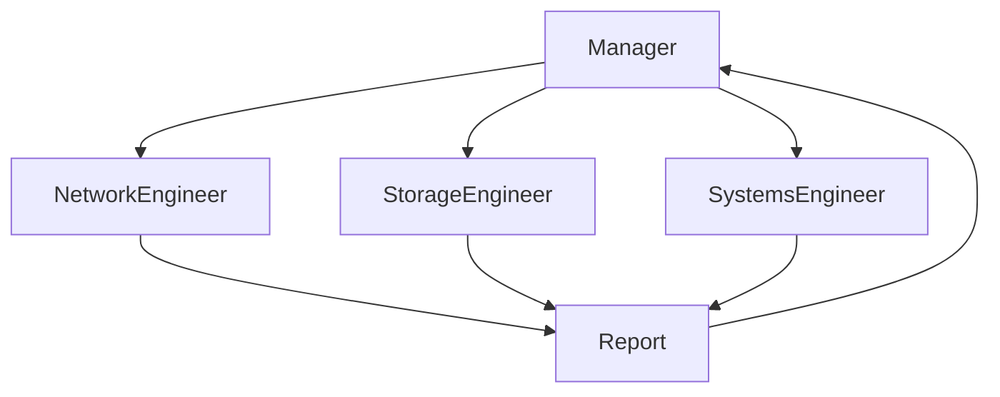
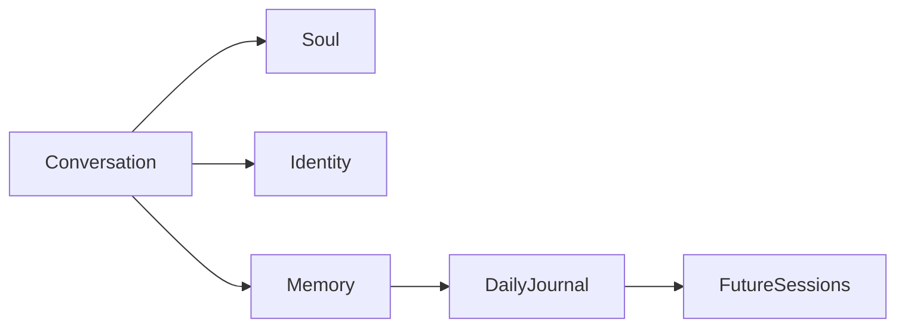
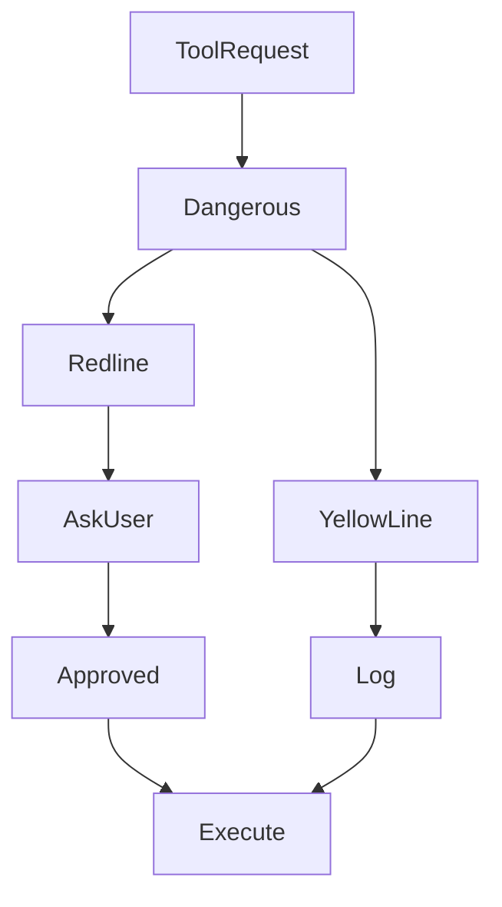
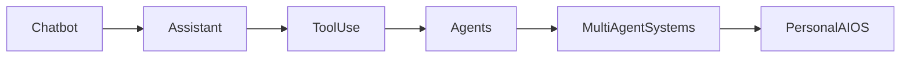

---
title: Openclaw and Nemoclaw
description: AI agents with tools and a security sandbox.
sidebar:
  order: 1
---


> This section provides, hands-on guide to understanding, installing, and using OpenClaw and Nemoclaw

---


# Table of Contents

1. Introduction to OpenClaw
2. Installation
3. OpenClaw Architecture
4. First-Time Onboarding
5. Telegram Integration
6. Skills
7. Open-Ended Skills and Subagents
8. Memory System
9. Security
10. NemoClaw
11. Final Thoughts

---

# Chapter 1 — Introduction to OpenClaw

## What is OpenClaw?

OpenClaw is **not an AI model.**

This is the first misconception most people have.

OpenClaw is a **gateway layer** that sits between an AI model and the outside world.

It connects:

- AI models
- Communication channels
- Memory
- Skills
- Local tools
- External services

Instead of talking directly to ChatGPT, Claude, or Gemini through their official interfaces, OpenClaw allows you to interact with those models through your own infrastructure and with added functionalities.

---

## Core Components of Openclaw

- AI Agent Framework
- Local and Cloud Deployment
- Multi-model Support
- Memory System
- Tool Execution
- Communication Channels
- Skills Marketplace
- Cron Jobs
- Heartbeats
- Open Source Architecture

---

## Why OpenClaw Became Popular

Traditional automation often requires:

- Workflow nodes
- Python scripts
- API integrations
- Dashboard creation
- Scheduling
- Multiple services

OpenClaw reduces many of those tasks to a single natural-language instruction.

Example:

Instead of manually building a cybersecurity news aggregation workflow, you can simply say:

> Monitor cybersecurity news from Reddit, YouTube, and Hacker News. Rate the content and build a dashboard.

---

## Where OpenClaw Fits

```text
                User
                  │
                  ▼
        Telegram / Discord / Slack (Several channel to talk to OpenClaw)
                  │
                  ▼
             OpenClaw Gateway
                  │
    ┌─────────────┼─────────────┐
    │             │             │
    ▼             ▼             ▼
 Memory         Skills      AI Model
    │             │             │
    ▼             ▼             ▼
Markdown      Bash/Python   OpenAI
Files         Browser       Claude
Journals      Cron Jobs     Gemini
Identity      Subagents     Ollama (Local models)
```

---

# Chapter 2 — Installation

We can install openclaw in Windows through their native app called OpenClaw Hub and on powershell also through their native powershell distribution. But this tool is specifically meant for linux so we will install it on WSL (Windows Subsytem for Linux).

For that we just need to run this command on our terminal -- ```wsl --install``` by default it will install latest Ubuntu distro.

## Requirements

We need:

- A WSL or Linux machine 
- An AI provider
- Telegram (for communication)

---

## Installation Flow



---

## Install OpenClaw

Visit:

```text
openclaw.ai
```

Copy the latest installation command.

Run it:

```bash
curl -fsSL https://openclaw.ai/install.sh | bash
```

Documentation changes frequently, so always use the latest installation command.

```markdown

```

---

# Chapter 3 — OpenClaw Architecture

## OpenClaw Is a Gateway

The OpenClaw process is simply a Node.js application running continuously.

We can check it using:

```bash
ps aux | grep claw
```

---

## The Four Pillars of OpenClaw

### 1. AI Models

OpenClaw supports:

- OpenAI
- Claude
- Gemini
- Ollama for local AI models

Changing the model is simply a brain transplant.

The memory stays intact.

---

### 2. Channels

Instead of forcing you to use a proprietary interface, OpenClaw itself comes to you. It has various communication channels like ...

- Telegram
- Discord
- Slack
- WhatsApp and many more

---

### 3. Memory

OpenClaw stores memory locally.

Unlike traditional AI systems, here the memory belongs to you.

---

### 4. Tools

The AI agent receives access to your machine. This is the main part where OpenClaw became famous. It can use several tools and execute a workflow.

Examples:

- Bash
- Cron
- Browser
- File system
- Search tools

---

## Architecture Diagram



---

# Chapter 4 — First-Time Onboarding

During setup, OpenClaw asks several questions.

---

## Select an AI Provider

Options include:

- OpenAI
- Anthropic
- Ollama

---

## Authentication

You can use:

### Option 1

API Key

```text
Pay as you go
```

### Option 2

Local AI model using Ollama 

```text
completely free forever and offline
```

---

## Model Selection

The video selects:

```text
GPT-5.4
```

---

## Hook Configuration

Enable:

- Bootstrap
- Command Logger
- Session Memory

---

## TUI (Terminal User Interface)

Instead of using a graphical interface, OpenClaw allows you to configure the entire agent through a terminal conversation.

---

## Agent Identity

Example configuration:

```text
Agent: Terry Crews

User: NetworkChuck fan

Personality: Chaotic
```

---

## Screenshot Placeholder

```markdown

```

---

# Chapter 5 — Telegram Integration

Telegram is the easiest communication channel to configure.

---

## Create a Telegram Bot

Search for:

```text
@BotFather
```

---

## Create a Bot

Commands:

```text
/newbot
```

---

## Configure the Bot

```text
Name →  Pravartak

Username → iitm_agentbot
```

Requirements:

```text
Username must end with "bot"
```

---

## Copy the Bot Token

```text
123456:abcdef...
```

---

## Connect OpenClaw to Telegram

Paste the token into your OpenClaw terminal.

---

## Security Layer

By default:

```text
Random users cannot interact with your agent.
```

You must explicitly authorize communication.

---

## Telegram Workflow



---

## Screenshot Placeholder

```markdown

```

---

# Chapter 6 — Skills

Skills extend an agent's capabilities.

---

## ClawHub

OpenClaw provides a marketplace called:

```text
ClawHub
```

The video mentions:

```text
33,000+ skills
```

---

## Install ClawHub

```bash
npm install -g clawhub
```

---

## Install a Skill

Example:

```bash
clawhub install word.docx
```

---

## Skill Execution



---

## Example

Request:

```text
Create a resume as a Microsoft Word document.
```

The agent:

- Generated a document
- Created a .docx file
- Returned the result

---

## Browser Skills

Example:

```text
Visit networkchuck.coffee
```

The agent:

- Opened a headless browser
- Navigated to the website
- Added a product to the cart

---

## Security Warning

The video states that approximately **12% of skills contained malware**.

Always verify skills before installation.

---

# Chapter 7 — Open-Ended Skills and Subagents

---

## What Is a Subagent?

A subagent is an independent worker delegated by the main agent.

Example:

```text
Research the best way to make coffee.
```

The main agent creates a temporary researcher.

---

## Telegram Commands

Check status:

```text
/status
```

List subagents:

```text
/agents list
```

---

## Multi-Agent Architecture

Example IT department:

```text
CTO
├── Network Engineer
├── Storage Engineer
└── Systems Engineer
```

---

## Multi-Agent Workflow



---

# Chapter 8 — Memory System

The memory system is one of OpenClaw's most interesting features.

---

## OpenClaw Directory

```bash
cd ~/.openclaw
```

---

## Agent Workspace

```bash
cd workspace
```

---

## File Structure

```text
.openclaw/

├── workspace/
│
├── soul.md
├── identity.md
├── memory.md
├── agents.md
│
└── memory/
    ├── 2026-08-16.md
    ├── 2026-08-17.md
    └── ...
```

---

## soul.md

Contains the agent's personality.

Example:

```bash
cat soul.md
```

---

## identity.md

Contains identity information.

Example:

```bash
cat identity.md
```

---

## memory.md

Stores long-term memory.

Example:

```bash
cat memory.md
```

---

## Daily Journals

Each day creates a new journal.

Example:

```text
Day 1:

Woke up.
```

---

## Memory Flow



---

# Chapter 9 — Security

The creator repeatedly emphasizes security.

---

## Run a Security Audit

```bash
openclaw security audit
```

---

## Deep Audit

```bash
openclaw security audit --deep
```

---

## Automatic Fixes

```bash
openclaw security audit --fix
```

---

## Verify the Web UI

Test:

```text
http://YOUR_IP:18789
```

If inaccessible:

```text
Good.
```

The UI should remain private.

---

## SSH Tunnel

Use SSH tunneling instead of exposing the interface publicly.

---

## Generate a Gateway Token

```bash
openclaw config
```

Navigate:

```text
Local Machine → Gateway → Token
```

---

## Enable the Firewall

Allow SSH only.

```text
Allow: 22

Block: Everything else
```

---

## Tool Profiles

Check:

```bash
openclaw config get tools.profile
```

---

### Coding Profile

Limited access:

- Files
- Terminal

---

### Full Profile

Access to:

- Browser
- Search
- External tools

---

## Tool Execution Permissions

Check:

```bash
openclaw config get tools.exec
```

Options:

```text
allowlist
deny
ask
full
```

---

## Redlines

Redlines are behavioral restrictions.

Example:

```text
Never modify SSH configuration.

Never exfiltrate private data.

Never execute destructive commands.
```

---

## Yellow Lines

Actions that should be logged:

```text
Firewall modifications

Docker commands
```

---

## Security Decision Tree



---

# Chapter 10 — NemoClaw

According to the video:

> NVIDIA describes OpenClaw as an operating system for personal AI.

NVIDIA responded by creating:

```text
NemoClaw
```

The idea:

```text
Personal AI Operating System
```

---

## Industry Trend

Multiple companies are converging toward the same architecture.

Examples:

- OpenClaw
- NemoClaw
- Anthropic Channels
- Anthropic Dispatch

---

## Industry Evolution



---

# Chapter 11 — Final Thoughts

## What OpenClaw Is

- Gateway
- Tool orchestration layer
- Memory manager
- Multi-channel communication platform

---

## What OpenClaw Is Not

- Not an AI model
- Not AGI
- Not magic

---

## Real Use Cases

- Personal assistant
- IT operations
- News aggregation
- Health assistant
- Email management
- Infrastructure monitoring
- Restaurant reservations
- Multi-agent teams

---

## Biggest Strength

OpenClaw makes advanced AI workflows feel accessible.

---

## Biggest Weakness

Security.

Giving an AI unrestricted access to a machine introduces serious risks.

---

## Key Commands Cheat Sheet

```bash
ps aux | grep claw

cd ~/.openclaw

cat soul.md

cat identity.md

cat memory.md

openclaw security audit

openclaw security audit --deep

openclaw security audit --fix

openclaw config

openclaw gateway restart

openclaw config get tools.profile

openclaw config set tools.profile full

openclaw config get tools.exec

npm install -g clawhub

clawhub install word.docx
```