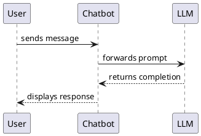
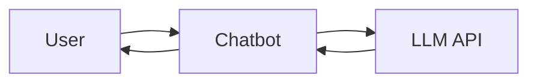

# Pravartak — Static Teaching Platform PRD

> **Purpose**: Hand this plan to a coding agent who will implement it from scratch.  
> **Hosting**: GitHub Pages, Cloudflare Pages (100% static, zero backend).

---

## 1. Chosen Static Site Builder: Astro + Starlight

### Why Astro + Starlight?

| Requirement | How Starlight satisfies it |
|---|---|
| Beautiful design, minimal code | Starlight ships a polished docs theme out of the box — dark/light mode, sidebar, TOC, breadcrumbs, responsive layout. Zero custom CSS needed to look great. |
| Markdown content | Astro has first-class `.md` / `.mdx` support with frontmatter, content collections, and type-safe schemas. |
| Kroki diagrams | Add `remark-kroki` (or a small custom remark plugin) — fenced code blocks like ` ```plantuml ` are replaced with inline SVGs at **build time** (no runtime API calls). |
| Marp slides | Custom Astro component `<SlideViewer>` that lazy-loads `@marp-team/marp-core` in the browser and renders slide decks from markdown files. |
| Slide annotation / pen drawing | Custom Astro "island" component (vanilla JS) — `<canvas>` overlay with drawing tools, undo/redo, save/load JSON locally. |
| Search | Starlight ships **Pagefind** out of the box — zero config, client-side full-text search with excellent performance. |
| GitHub Pages / Cloudflare Pages | Astro has official deployment adapters and docs for both. Static output via `astro build`. |

### Alternatives considered

| Tool | Why not |
|---|---|
| MkDocs Material | Great for pure docs, but extending it for Marp slides + annotation canvas would require fighting the Python plugin system. |
| VitePress | Vue-only; adding interactive canvas annotation would require Vue wrapper overhead. |
| Docusaurus | React-heavy, larger bundle, overkill for content-only site. |
| Hugo | Fast builds, but Go templating is less ergonomic for custom interactive components. |

---

## 2. Curriculum — Module Grouping

Group the 19 topics from [Final-Topics.md](file:///home/bitu/Documents/May2026/CyStar/Pravartak/Final-Topics.md) into **8 modules**:

### Module 1 — Foundations of LLMs & Chatbots
| # | Topic |
|---|---|
| 1 | Basic Chatbot Demo (Open-source LLMs via OpenRouter) |
| 3 | Transformer Architecture |
| 4 | Different Types of LLMs: Gemma, Diffusion Models, MoE, etc. |

### Module 2 — Retrieval-Augmented Generation (RAG)
| # | Topic |
|---|---|
| 2 | RAG, BM25 / Hybrid Search, Vector DBs, Embeddings, ChromaDB, SQLite |
|   | → Stage 1: Vector Chatbot (Vector DB + Embeddings) |
|   | → Stage 2: BM25 & Hybrid Search |

### Module 3 — Tool Calling, Agents & Workflows
| # | Topic |
|---|---|
| 5 | Introduction to Tool Calling and Agentic AI |
| 10 | MCP (Integrate existing server → Create & deploy new server) |
| 13 | LangSmith, LangGraph, and Agentic Workflows |

### Module 4 — Local LLMs & CLI Tooling
| # | Topic |
|---|---|
| 7 | Local LLMs: Ollama (Pull/Run, Modelfile, API integration) |
| 8 | CLI Tools: Claude Code (MCP, plan mode, prompting, architecture) |
| 15 | OpenClaw / NemoClaw |

### Module 5 — Fine-Tuning & Evaluation
| # | Topic |
|---|---|
| 6 | Fine-Tuning |
| 12 | *(Optional)* LLM Evals and Cost Monitoring |

### Module 6 — Containerization & DevOps
| # | Topic |
|---|---|
| 9 | Containers: Docker / Podman (Images, Volumes, Compose, Docker Hub) |
| 11 | CI/CD: GitHub Actions and Hugging Face Spaces |
| 14 | *(Optional)* Sandboxing with LXD and Fly.io |

### Module 7 — AWS Cloud Deployment
| # | Topic |
|---|---|
| 19 | Cloud Deployment on AWS — S3, Bedrock, EC2, Lambda |

### Module 8 — Specialized Topics
| # | Topic |
|---|---|
| 16 | *(Optional)* Requestly for API interception |
| 17 | Crontab + Loop Engineering |
| 18 | TTS & STT |

---

## 3. Project Folder Structure

```
Pravartak/
├── astro.config.mjs                ← Astro + Starlight config
├── package.json
├── tsconfig.json
├── public/
│   └── favicon.svg
│
├── src/
│   ├── content/                    ← ★ ALL teaching content (Astro content collections)
│   │   ├── config.ts               ← Content collection schema
│   │   └── docs/                   ← Starlight docs pages (auto-routed)
│   │       ├── index.mdx           ← Home / landing page
│   │       ├── module-01-llm-foundations/
│   │       │   ├── 01-basic-chatbot.md
│   │       │   ├── 02-transformer-architecture.md
│   │       │   └── 03-types-of-llms.md
│   │       ├── module-02-rag/
│   │       │   └── 01-rag-overview.md
│   │       ├── module-03-agents-workflows/
│   │       │   └── ...
│   │       ├── module-04-local-llms-cli/
│   │       │   └── ...
│   │       ├── module-05-finetuning-eval/
│   │       │   └── ...
│   │       ├── module-06-containerization-devops/
│   │       │   └── ...
│   │       ├── module-07-aws-cloud/
│   │       │   └── ...
│   │       └── module-08-specialized/
│   │           └── ...
│   │
│   ├── slides/                     ← Marp slide decks (markdown, NOT in content collection)
│   │   ├── module-01-basic-chatbot.md
│   │   └── module-02-rag-overview.md
│   │
│   ├── components/                 ← Custom Astro components
│   │   ├── SlideViewer.astro       ← Marp slide renderer (Astro island)
│   │   ├── SlideCanvas.astro       ← Annotation canvas overlay
│   │   ├── KrokiDiagram.astro      ← (optional) explicit Kroki component for MDX
│   │   └── Assignment.astro        ← Collapsible assignment block
│   │
│   ├── plugins/                    ← Remark/Rehype plugins
│   │   └── remark-kroki.mjs        ← Transforms fenced code blocks into Kroki SVGs at build time
│   │
│   └── styles/
│       └── custom.css              ← Minimal overrides on top of Starlight's theme
│
└── slides-assets/                  ← Any images/assets referenced by slide decks
```

> **Content authors only touch**: `src/content/docs/` (lessons) and `src/slides/` (presentations). Everything else is infrastructure.

---

## 4. Tech Stack

| Layer | Tool | Purpose |
|---|---|---|
| **SSG** | Astro v5 + `@astrojs/starlight` | Build engine, routing, theme |
| **Content** | Astro Content Collections (`.md` / `.mdx`) | Type-safe markdown with frontmatter schema |
| **Diagrams** | `remark-kroki` custom plugin (build-time) | Fenced code blocks → inline SVGs via Kroki API during `astro build` |
| **Slides** | `@marp-team/marp-core` (client-side, lazy) | Render Marp markdown as slide decks in-browser |
| **Annotations** | Vanilla JS `<canvas>` (Astro island) | Pen/highlighter/eraser drawing on slides |
| **Search** | Pagefind (built-in to Starlight) | Client-side full-text search, zero config |
| **Syntax highlighting** | Shiki (built-in to Astro) | Code block highlighting |
| **Fonts** | Google Fonts (Inter + JetBrains Mono) | Typography |
| **Deploy** | `astro build` → static HTML | GitHub Pages / Cloudflare Pages |

---

## 5. Detailed Feature Specifications

### 5.1 Markdown Lessons (handled by Starlight out of the box)

Starlight provides automatically:
- Sidebar navigation generated from folder structure
- Table of contents (right sidebar)
- Breadcrumbs
- Previous / Next navigation
- Dark/Light mode toggle
- Mobile responsive hamburger menu
- Pagefind search (Ctrl+K)

Each lesson is a standard markdown file with Starlight frontmatter:

```markdown
---
title: "Basic Chatbot Demo"
description: "Build your first chatbot using open-source LLMs via OpenRouter"
sidebar:
  order: 1
  badge:
    text: "Starter"
    variant: "tip"
---

# Basic Chatbot Demo

Your lesson content here with **markdown**, `code`, and diagrams...
```

### 5.2 Kroki Diagrams (build-time remark plugin)

```
Implementation:
1. Create `src/plugins/remark-kroki.mjs` — a remark plugin that:
   a. Walks the markdown AST for fenced code blocks
   b. Checks if language is a Kroki-supported type
      (plantuml, mermaid, d2, graphviz, excalidraw, ditaa, etc.)
   c. Sends the diagram source to `https://kroki.io/{lang}/svg` via
      fetch() at BUILD TIME (not runtime)
   d. Replaces the code block AST node with an inline  or raw SVG
   e. Adds a small "Edit in Kroki" link beneath each diagram
2. Register the plugin in `astro.config.mjs` under `markdown.remarkPlugins`
3. If the public Kroki API is too slow, note that Kroki can be self-hosted
   via Docker as a fallback.
```

**Usage in markdown** (authors just write fenced code blocks):

````markdown

````

Alternatively, for MDX files provide a `<KrokiDiagram lang="plantuml">` component.

### 5.3 Marp Slide Viewer (custom Astro island component)

```
Implementation:
1. Create `src/components/SlideViewer.astro`
   - Accepts a `src` prop pointing to a slide markdown file path
   - Uses `client:visible` directive (Astro island — loads JS only when visible)
   - Client-side JS:
     a. Fetches the Marp markdown file
     b. Loads @marp-team/marp-core from CDN (lazy, ~200kB)
     c. Renders slides into a full-viewport overlay/modal
     d. Implements:
        - Arrow key / click navigation between slides
        - Slide counter ("3 / 12")
        - Fullscreen toggle (Fullscreen API)
        - Presenter notes toggle (parsed from `<!-- notes -->`)
        - Escape key to close

2. Lessons embed slides with an MDX component or a styled link:
   ```mdx
   import SlideViewer from '../../components/SlideViewer.astro';

   <SlideViewer src="/slides/module-01-basic-chatbot.md" title="Basic Chatbot Slides" />
   ```
   This renders as a styled button "📽 Open Slides" that launches the viewer.
```

### 5.4 Slide Annotation / Pen Drawing (Astro island)

```
Implementation:
1. Create `src/components/SlideCanvas.astro`
   - Rendered INSIDE the SlideViewer overlay, on top of each slide
   - Transparent <canvas> element with pointer event listeners
   - Floating toolbar (bottom-center) with:

     TOOLS:
     - Pen (default) — smooth freehand drawing
     - Highlighter — semi-transparent stroke (alpha 0.35)
     - Eraser — composite destination-out

     SIZES:
     - Fine (2px), Medium (4px), Thick (8px)

     COLORS:
     - 6 presets: Red, Blue, Green, Yellow, Purple, White

     ACTIONS:
     - Undo / Redo (stack-based — push on pointerup, pop on undo)
     - Clear current slide
     - Save annotations → downloads JSON file:
       `{deckName}-annotations-{timestamp}.json`
     - Load annotations → file picker to restore a saved JSON
     - Toggle drawing mode on/off

2. Data model per slide:
   {
     slideIndex: number,
     strokes: [
       { tool: "pen"|"highlighter"|"eraser",
         color: "#ef4444",
         width: 4,
         points: [{x, y}, {x, y}, ...] }
     ]
   }

3. Persistence:
   - Auto-save to localStorage keyed by slide deck path
   - Survives page refresh
   - Explicit "Save" button downloads the full annotation set as a .json file
   - "Load" button imports a previously saved .json and re-draws
```

### 5.5 Assignment Blocks

```
Implementation:
1. Create `src/components/Assignment.astro`
   - Renders a collapsible <details> block with styled summary
   - Used in MDX files:
     ```mdx
     <Assignment title="Module 1 Assignment">
       1. Build a chatbot that responds to user queries using OpenRouter.
       2. Add conversation history (last 5 messages).
       3. Deploy it as a CLI tool.
     </Assignment>
     ```
   - Styled with accent gradient header, 📝 icon, smooth expand animation

2. Alternatively, use a custom remark plugin that auto-wraps
   `## Assignment` sections into <details> elements, so plain
   `.md` files (not just `.mdx`) also get the collapsible behavior.
```

### 5.6 Custom Styling (minimal overrides)

Starlight uses CSS custom properties. Override only what's needed in `src/styles/custom.css`:

```css
/* Import in astro.config.mjs via customCss: ['./src/styles/custom.css'] */

:root {
  --sl-color-accent-low: #1e1b4b;
  --sl-color-accent: #6366f1;
  --sl-color-accent-high: #c7d2fe;
  --sl-font: 'Inter', sans-serif;
  --sl-font-mono: 'JetBrains Mono', monospace;
}

/* Kroki diagram container */
.kroki-diagram { text-align: center; margin: 1.5rem 0; }
.kroki-diagram img { max-width: 100%; border-radius: 8px; }

/* Slide viewer button */
.slide-open-btn { /* styled button for opening slide decks */ }

/* Assignment details block */
details.assignment { /* collapsible styling */ }
```

---

## 6. Configuration Files

### `astro.config.mjs`

```js
import { defineConfig } from 'astro/config';
import starlight from '@astrojs/starlight';
import remarkKroki from './src/plugins/remark-kroki.mjs';

export default defineConfig({
  site: 'https://<username>.github.io',
  base: '/Pravartak',
  integrations: [
    starlight({
      title: 'Pravartak',
      description: 'AI & DevOps Learning Platform',
      logo: { src: './public/favicon.svg' },
      social: { github: 'https://github.com/<username>/Pravartak' },
      customCss: ['./src/styles/custom.css'],
      sidebar: [
        {
          label: 'Module 1 — LLM Foundations',
          autogenerate: { directory: 'module-01-llm-foundations' },
        },
        {
          label: 'Module 2 — RAG',
          autogenerate: { directory: 'module-02-rag' },
        },
        {
          label: 'Module 3 — Agents & Workflows',
          autogenerate: { directory: 'module-03-agents-workflows' },
        },
        {
          label: 'Module 4 — Local LLMs & CLI',
          autogenerate: { directory: 'module-04-local-llms-cli' },
        },
        {
          label: 'Module 5 — Fine-Tuning & Eval',
          autogenerate: { directory: 'module-05-finetuning-eval' },
        },
        {
          label: 'Module 6 — Containerization & DevOps',
          autogenerate: { directory: 'module-06-containerization-devops' },
        },
        {
          label: 'Module 7 — AWS Cloud',
          autogenerate: { directory: 'module-07-aws-cloud' },
        },
        {
          label: 'Module 8 — Specialized Topics',
          autogenerate: { directory: 'module-08-specialized' },
        },
      ],
    }),
  ],
  markdown: {
    remarkPlugins: [remarkKroki],
  },
});
```

---

## 7. Step-by-Step Implementation (for the coding agent)

> Follow this order. Each step should be a commit-sized chunk.

### Step 1 — Scaffold Astro + Starlight Project
1. Run `npx -y create-astro@latest ./` with the Starlight template (check `--help` first for exact flags).
2. Install dependencies: `npm install`.
3. Verify it builds and runs: `npm run dev`.
4. Add Google Fonts (Inter + JetBrains Mono) via `<link>` in a custom `<head>` or via Starlight's `head` config.
5. Create `src/styles/custom.css` with the accent color overrides and font assignments.
6. Update `astro.config.mjs` with the sidebar structure from §6, `customCss`, and site metadata.

### Step 2 — Create Content Collection & Sample Lessons
1. Set up the folder structure under `src/content/docs/` as shown in §3 (all 8 module directories).
2. Create **at least 2 full sample lessons** with:
   - Proper frontmatter (`title`, `description`, `sidebar.order`, `sidebar.badge`)
   - Rich markdown: headings, lists, code blocks, bold, links, a table
   - A fenced Kroki diagram block (PlantUML or Mermaid — will render after Step 3)
   - An `## Assignment` section at the end
3. Create a home/landing page at `src/content/docs/index.mdx` that welcomes users and links to modules.
4. Verify: `npm run dev` — sidebar shows modules, lessons render correctly.

### Step 3 — Kroki Diagram Plugin
1. Create `src/plugins/remark-kroki.mjs`:
   - Use `unist-util-visit` to walk the AST.
   - For each `code` node whose `lang` matches a Kroki type:
     a. `fetch()` the diagram from `https://kroki.io/{lang}/svg` (POST with the source text in body, or GET with deflate+base64url encoding).
     b. Replace the code node with an `html` node containing `<div class="kroki-diagram"></div>`.
     c. Add a small "Edit in Kroki" link using a Kroki playground URL.
   - **Important**: This runs at build-time, so `fetch()` is fine (Node environment).
2. Register in `astro.config.mjs` under `markdown.remarkPlugins`.
3. Install `unist-util-visit` as a dev dependency.
4. Verify: rebuild, check that the sample lesson's PlantUML renders as an inline SVG.

### Step 4 — Assignment Component
1. Create `src/components/Assignment.astro`:
   - Accepts `title` prop (default: "Assignment").
   - Renders a styled `<details class="assignment">` with `<summary>` and slotted content.
   - Style in `custom.css`: accent gradient header, 📝 icon, expand animation.
2. Alternatively/additionally, create a remark plugin `remark-assignment.mjs` that wraps `## Assignment` sections in `<details>` for plain `.md` files.
3. Update sample lessons to use the Assignment component (MDX) or `## Assignment` heading (plain md).
4. Verify: assignments render as collapsible blocks.

### Step 5 — Marp Slide Viewer Component
1. Create `src/components/SlideViewer.astro`:
   - Server side: renders a styled button "📽 Open Presentation".
   - Client side (`client:visible`): on click, opens a full-screen overlay.
   - Client JS:
     a. Fetch the slide markdown file (from `src/slides/` — copy to `public/slides/` at build or use Vite's raw import).
     b. Dynamically import `@marp-team/marp-core` from CDN (`https://esm.sh/@marp-team/marp-core`).
     c. Call `marp.render(markdownText)` to get HTML + CSS.
     d. Inject into a slide container `<div>`.
     e. Parse slides by `<section>` tags, show one at a time.
     f. Add keyboard navigation (←→ arrows, Escape to close).
     g. Add slide counter, fullscreen button, presenter notes toggle.
2. Copy slide markdown files to `public/slides/` during build (or use a simple script).
3. Install `@marp-team/marp-core` as a dependency (for types/reference), but load from CDN at runtime.
4. Update a sample lesson MDX to embed `<SlideViewer src="/slides/module-01-basic-chatbot.md" />`.
5. Create **1 sample Marp slide deck** at `src/slides/module-01-basic-chatbot.md` with 5+ slides and presenter notes.
6. Verify: clicking the button opens the slide deck, navigation works.

### Step 6 — Annotation Canvas
1. Create `src/components/SlideCanvas.astro`:
   - Renders a `<canvas>` element overlaid on the current slide.
   - Client-side vanilla JS handles:
     a. Pointer event listeners (pointerdown, pointermove, pointerup) for drawing.
     b. Tool state: pen (default), highlighter (alpha 0.35), eraser (globalCompositeOperation: destination-out).
     c. Size state: fine (2px), medium (4px), thick (8px).
     d. Color state: 6 presets.
     e. Undo/redo: push canvas snapshot to stack on `pointerup`; pop on undo.
     f. Clear: clear canvas for current slide.
     g. Save: serialize all slides' stroke data to JSON, trigger `<a download>`.
     h. Load: `<input type="file" accept=".json">`, parse JSON, redraw all strokes.
     i. localStorage: auto-persist annotations keyed by slide deck path.
2. Integrate into `SlideViewer.astro` — canvas appears when user toggles "Draw" mode.
3. Floating toolbar appears at bottom-center with all tool/action buttons.
4. Verify: draw on a slide, undo/redo, save JSON, reload page (localStorage), load JSON.

### Step 7 — Polish & Landing Page
1. Enhance `src/content/docs/index.mdx`:
   - Hero section with gradient title, subtitle, stats (8 modules, 19 topics).
   - Module cards grid linking to each module's first lesson.
   - Use Starlight's built-in components (`<Card>`, `<CardGrid>`, `<LinkCard>`) if available.
2. Add a custom `favicon.svg`.
3. Verify search works (Pagefind — should be automatic with Starlight).
4. Test responsive layout on mobile viewports.
5. Run `npm run build` — ensure clean static output.

### Step 8 — Deployment Configuration
1. Add GitHub Actions workflow at `.github/workflows/deploy.yml`:
   - Trigger on push to `main`.
   - Install Node, `npm ci`, `npm run build`.
   - Deploy `dist/` to GitHub Pages using `actions/deploy-pages@v4`.
2. Add `wrangler.toml` or `_headers` / `_redirects` for Cloudflare Pages (optional).
3. Document deployment steps in `README.md`.

### Step 9 — README & Content Authoring Guide
1. Create `README.md` with:
   - Project overview.
   - Quick start: `npm install && npm run dev`.
   - How to add a new lesson (create `.md` file in the right module folder).
   - How to add slides (create Marp markdown in `src/slides/`).
   - How to embed a Kroki diagram (fenced code block with diagram language).
   - How to add an assignment (use `## Assignment` or `<Assignment>` component).
   - Deployment instructions for GitHub Pages and Cloudflare Pages.

---

## 8. Content Authoring Guide (include in README)

### Writing a Lesson (plain `.md`)

```markdown
---
title: "Basic Chatbot Demo"
description: "Build your first chatbot using open-source LLMs via OpenRouter"
sidebar:
  order: 1
  badge:
    text: "Starter"
    variant: "tip"
---

# Basic Chatbot Demo

Lesson content here...

## Assignment

1. Build a chatbot that responds to user queries.
2. Add conversation history.
```

### Embedding a Diagram

Just use a fenced code block with the diagram language:

````markdown

````

### Writing Slides (Marp format, in `src/slides/`)

```markdown
---
marp: true
theme: default
paginate: true
---

# Basic Chatbot Demo

Welcome to Module 1

---

## What is an LLM?

- Large Language Model
- Trained on internet-scale text

<!-- Speaker notes: Explain the scale of training data -->

---

## Demo

\```python
import openai
client = openai.OpenAI(base_url="https://openrouter.ai/api/v1")
\```
```

### Embedding Slides in a Lesson (`.mdx`)

```mdx
---
title: "Basic Chatbot Demo"
---

import SlideViewer from '../../components/SlideViewer.astro';

# Basic Chatbot Demo

Content here...

<SlideViewer src="/slides/module-01-basic-chatbot.md" title="Basic Chatbot Slides" />

## Assignment
...
```

---

## 9. Constraints & Non-Goals

| Constraint | Detail |
|---|---|
| **No backend** | Everything is static; no databases, no auth |
| **Astro + Starlight only** | No additional frameworks (React/Vue/Svelte) unless needed for a specific island |
| **Minimal custom code** | Leverage Starlight defaults; only customize where necessary (Kroki plugin, Slide viewer, Annotation canvas) |
| **Build-time diagrams** | Kroki diagrams are fetched at `astro build`, not at runtime — so the deployed site works without any API calls |

| Non-Goal | Why |
|---|---|
| User accounts / progress tracking | Static site, no backend |
| Live collaborative annotation | Would require WebRTC / server |
| Video hosting | Link to external platforms (YouTube) |
| CMS / admin panel | Content is authored as markdown in the repo |

---

## 10. Verification Plan

### Build & Dev
```bash
npm run dev          # Local dev server
npm run build        # Production build
npx serve dist/      # Preview production build locally
```

### Manual Checklist
- [ ] Home page renders with module cards linking to each module
- [ ] Sidebar shows all 8 modules with correct lessons nested
- [ ] Markdown lessons render correctly (headings, lists, code, tables, links)
- [ ] Kroki diagrams render as inline images (test PlantUML + Mermaid)
- [ ] "Edit in Kroki" link works beneath diagrams
- [ ] Marp slide viewer opens in full-screen overlay
- [ ] Slide navigation works (arrow keys, click)
- [ ] Slide counter, fullscreen, presenter notes all work
- [ ] Annotation pen draws on slides; highlighter and eraser work
- [ ] Undo/redo works for annotations
- [ ] Save annotations downloads a `.json` file
- [ ] Load annotations restores saved drawings
- [ ] Annotations persist across page refresh (localStorage)
- [ ] Assignment sections render as collapsible blocks
- [ ] Pagefind search works (Ctrl+K)
- [ ] Responsive layout works on mobile (< 768px)
- [ ] `npm run build` produces clean static output in `dist/`
- [ ] Deploys cleanly to GitHub Pages
